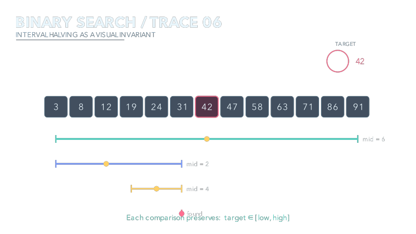
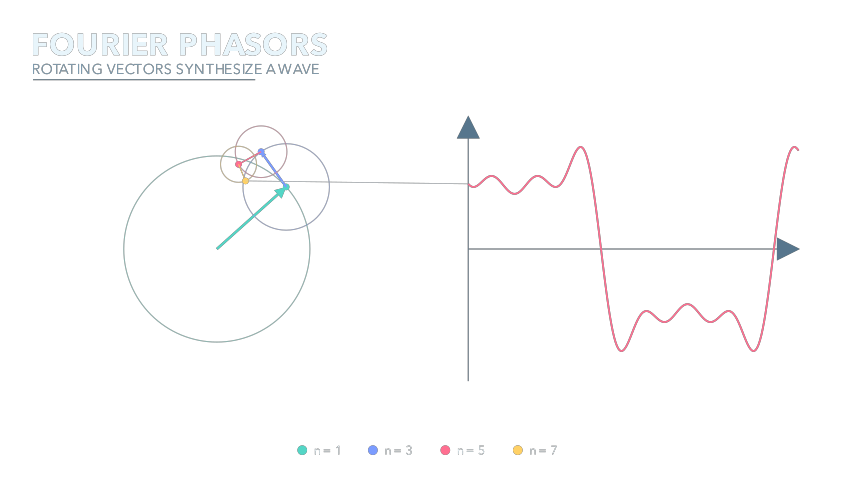
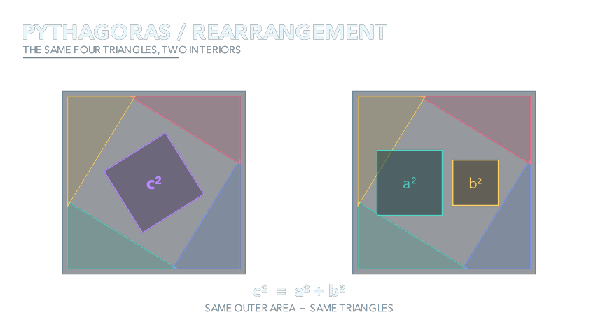

# Manim Demos

Explanatory scenes where the transparent PNG is the primary deliverable and a short MP4 preserves the temporal argument.

| Scene | Transparent still | Motion |
|---|---|---|
| Binary-search trace |  | [MP4](out/algorithm-trace.mp4) |
| Fourier phasors |  | [MP4](out/fourier-phasors.mp4) |
| Pythagorean rearrangement |  | [MP4](out/geometric-proof.mp4) |

```bash
uv sync
uv run python scripts/render.py
uv run ruff check .
uv run pytest
```

The renderer executes Manim twice per scene: a last-frame Cairo render with alpha, and a low-resolution explanatory video. PNGs are checked for real transparency and visual content; videos are checked with `ffprobe`.
