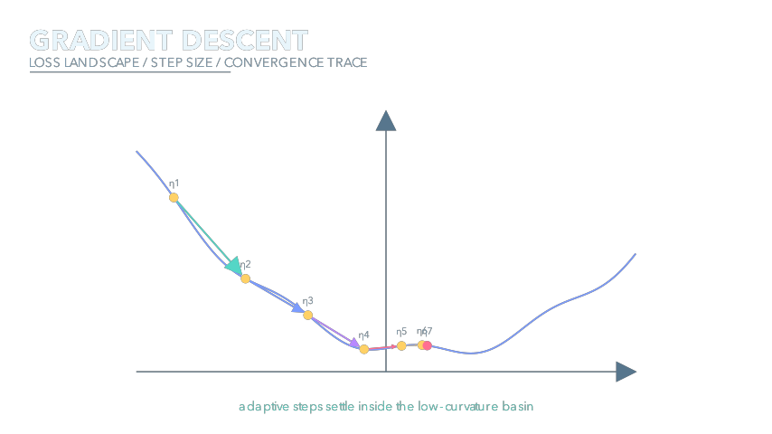
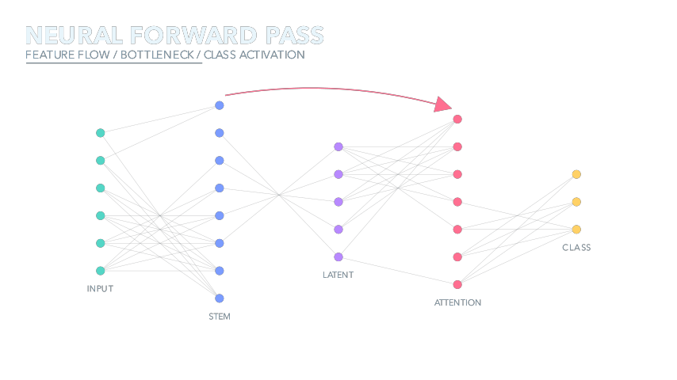
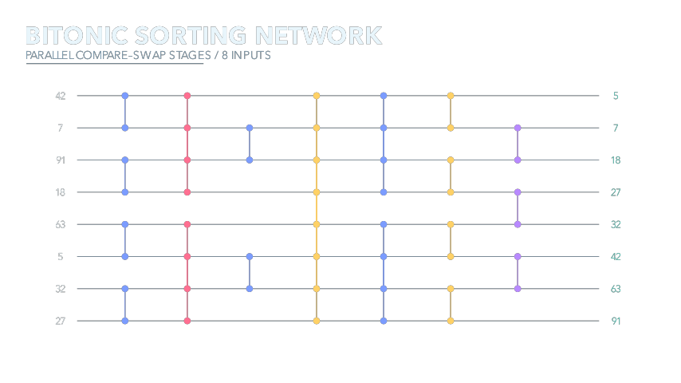
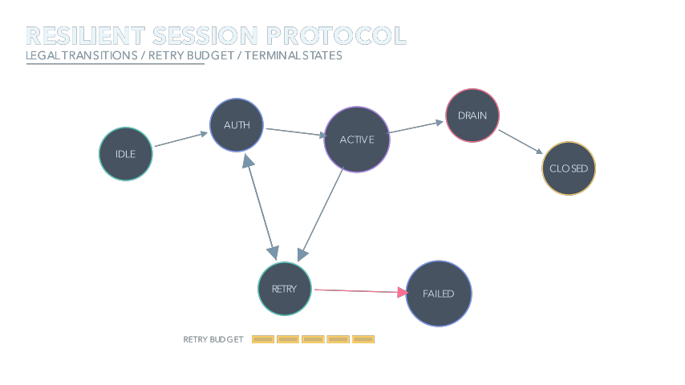
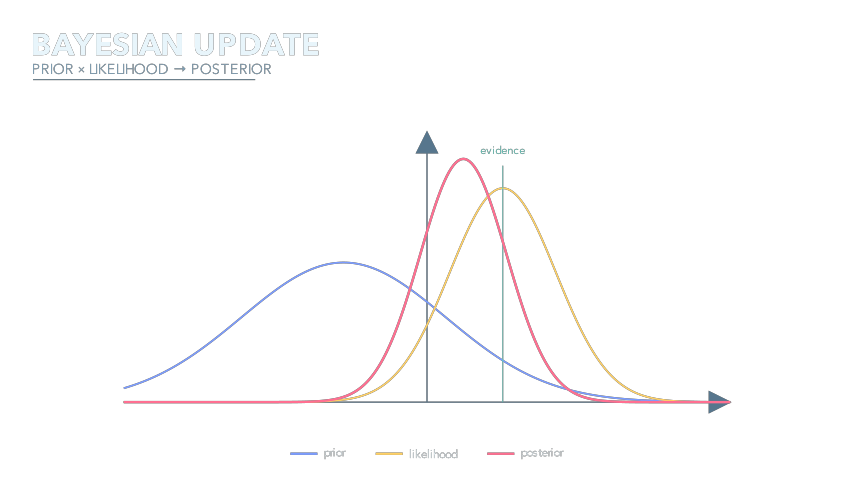
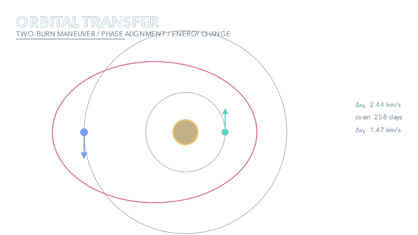
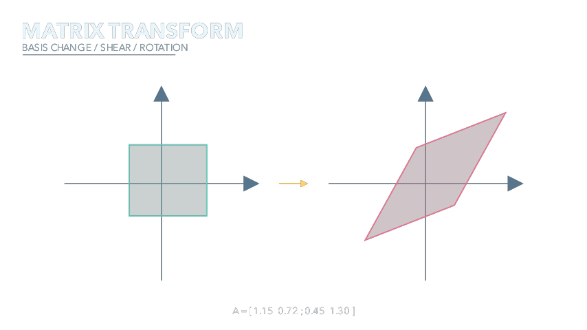
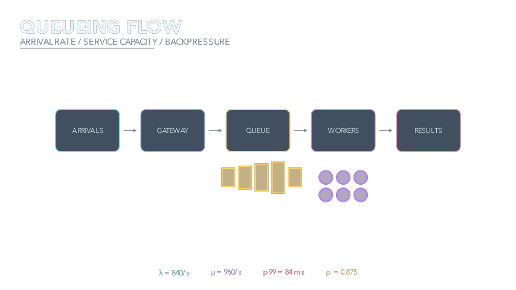
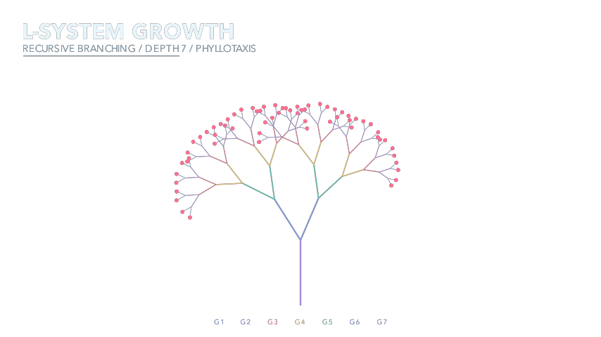

# Manim Demos

Twelve explanatory reference scenes where the transparent PNG is the primary deliverable and a short MP4 preserves the temporal argument.

`catalog.json` records the teaching use, question, temporal visual family, complexity, and tags.

| Search trace | Fourier | Geometry proof | Gradient descent |
|---|---|---|---|
| [](out/algorithm-trace.mp4) | [](out/fourier-phasors.mp4) | [](out/geometric-proof.mp4) | [](out/gradient-descent.mp4) |
| Neural pass | Sorting network | State machine | Bayesian update |
| [](out/neural-forward-pass.mp4) | [](out/sorting-network.mp4) | [](out/protocol-state-machine.mp4) | [](out/bayesian-update.mp4) |
| Orbital transfer | Matrix transform | Queue flow | L-system |
| [](out/orbital-transfer.mp4) | [](out/matrix-transform.mp4) | [](out/queueing-flow.mp4) | [](out/l-system-growth.mp4) |

```bash
uv sync
uv run python scripts/render.py
uv run ruff check .
uv run pytest
```

The renderer executes Manim twice per scene: a last-frame Cairo render with alpha, and a low-resolution explanatory video. PNGs are checked for real transparency and visual content; videos are checked with `ffprobe`.
